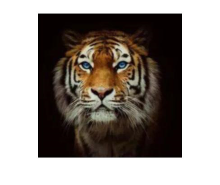
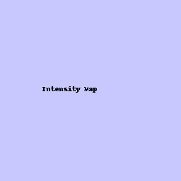
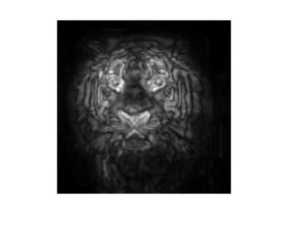

# Image Saliency Detection

This project demonstrates a visual saliency detection algorithm based on human visual attention mechanisms using MATLAB. The algorithm identifies salient regions in an image using:

- Multiscale sampling
- RGB color separation
- Intensity map extraction
- Gabor-based orientation filtering
- RG/BY color opponency modeling
- Final saliency map fusion

## 📂 Project Structure

```
image-saliency-detection/
├── docs/                  # Report and documentation
├── images/                # Output and visualization
├── src/                   # MATLAB source code
│   └── saliency_detection.m
├── README.md
```

## 🧠 Algorithm Overview


1. Original image is filtered using a Gaussian kernel.
2. Multiscale image pyramids are built.
3. Features such as intensity, color (RG/BY), and orientation (0°, 45°, 90°, 135°) are extracted.
4. Feature maps are normalized and combined to generate the final saliency map.

## 📷 Sample Visualizations

| Step | Image |
|------|-------|
| Original |  |
| Filtered |  |
| Intensity |  |
| Saliency Map |  |

## 🧪 Running the Code

Open MATLAB and run:

```matlab
saliency_detection
```

Ensure the input image (`tiger.jpg`) and helper functions (e.g., `normalizeImage`, `mygaborfilter`) are in the same folder.

## 📑 Report

Detailed explanation can be found in [docs/report.md](docs/report.md).

---

